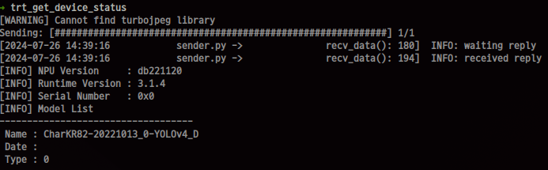
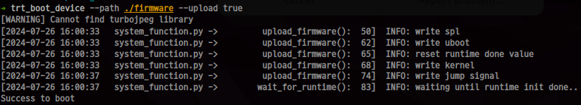
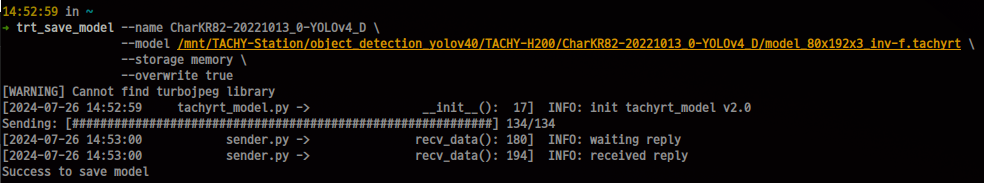
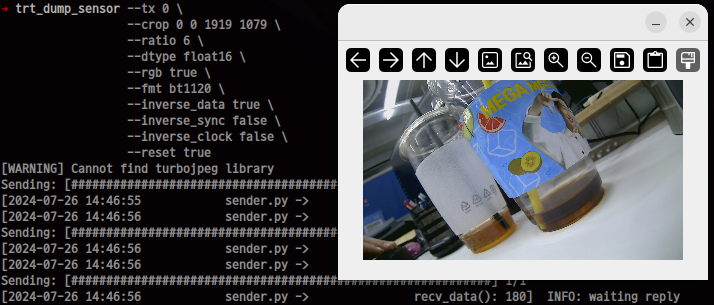
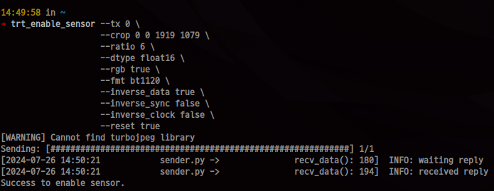
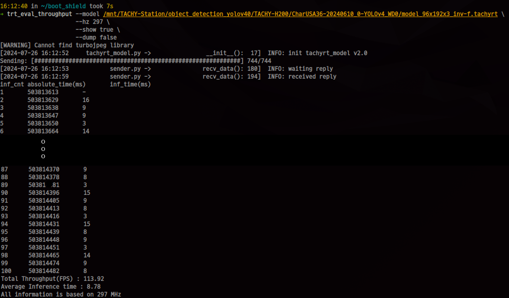
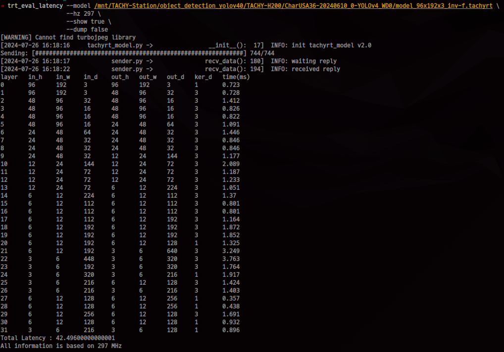

## What is this?
Tachy-Runtime API를 활용한 예제 스크립트 입니다. <br>
Tachy Device를 제어하기 위한 다양한 기능을 제공하며 다음과 같은 4개의 큰 카테고리별로 기능이 존재합니다. <br>
1. system function <br>
 => 시스템 제어와 관련된 기능을 제공합니다
2. sensor    function <br>
 => 센서 인터페이스 제어와 관련된 기능을 제공합니다
3. debug     function <br>
 => 모델에 대한 디버깅 기능을 제공합니다
4. inference function <br>
 => 추론과 관련된 기능을 제공합니다
5. example function <br>
 => 4번(inference function)을 활용하여 구현한 예제 어플리케이션입니다.

## How to install <br>
1. Runtime API(python) 설치
``` python
pip install common/whl/tachy_rt-3.2.0-py3-none-any.whl
```

2. install script 실행
``` bash
# sudo 권한 필요(실행 스크립트를 /bin 경로로 복사함)
./bin/install.sh
```

## How to set interface environment
Tachy Device와 통신을 하기 위해서는 아래와 같이 인터페이스에 대한 환경변수를 설정해주어야 합니다. <br>
Tachy Device별로 사용 가능한 인터페이스는 서로 다르며 본인이 사용하고 있는 Device를 확인해야합니다. <br>
가능한 인터페이스는 TCP or spi or local 이며 아래는 각 보드별로 사용 가능한 인터페이스 입니다.

``` bash
export TACHY_INTERFACE=spi:host
```

## How to use it
### 1. system function
1-1. Get status from bs <br>
=> Tachy Device의 현재 상태를 읽기위한 용도
``` bash
trt_get_device_status
```


1-2. HostSPI booting <br>
=> HostSPI를 사용한 Booting
``` bash
# 'TACHY_INTERFACE' must be spi:<type>
trt_boot_device --path <path for firmware> --upload <true or false>
```


1-3. Save model <br>
=> TACHY-Compiler를 통해서 나온 Model을 BS에 저장한다.
``` bash
trt_save_model --name <name> \
               --model <path for model> \
               --storage <memory or nor> \
               --overwrite <true or false>
```



### 2. Sensor functions
2-1. Dump sensor image <br>
=> Sensor Interface를 통해서 들어오고 있는 데이터를 시각적으로 확인하기 위한 용도<br>
=> 이미지는 기본적으로 FHD(1920x1080) 기준이며 Ratio 설정값에 따라 FHD / Ratio 사이즈의 이미지가 써짐
``` bash
trt_dump_sensor --tx <TX> \
                --crop <x0> <y0> <x1> <y1> \
                --ratio <0 ~ 6> \
                --dtype <flaot16 or uint8> \
                --rgb <true or false> \
                --fmt <BT1120 or BT656 or Bayer> \
                --rgb <true or false> \
                --inverse_data <true or false> \
                --inverse_sync <true or false> \
                --inverse_clock <true or false> \
                --reset <true or false>
```


2-2. Enable sensor
``` bash
trt_enable_sensor --tx <TX> \
                  --crop <x0> <y0> <x1> <y1> \
                  --ratio <0 ~ 6> \
                  --dtype <flaot16 or uint8> \
                  --rgb <true or false> \
                  --fmt <BT1120 or BT656 or Bayer> \
                  --inverse_data <true or false> \
                  --inverse_sync <true or false> \
                  --inverse_clock <true or false> \
                  --reset <true or false>
```



### 3. Debug functions
3-1. Evaluate Throughput(=FPS) <br>
=> Model의 Throughput(FPS)를 측정한다.
``` bash
trt_eval_throughput --model <path to model> \
                    --hz <297 or 200 or 100> \
                    --show <true or false> \
                    --dump <true or false>
```


3-2. Evaluate Latency <br>
=> Model의 Latency를 측정한다.
``` bash
trt_eval_latency --model <path to model> \
                 --hz <297 or 200 or 100> \
                 --show <true or false> \
                 --dump <true or false>
```


### 4. Inference functions
TODO

### 5. Example Function
=> example 디렉터리 참조
